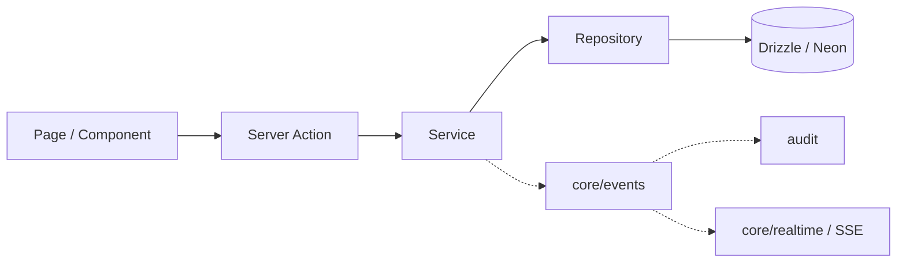
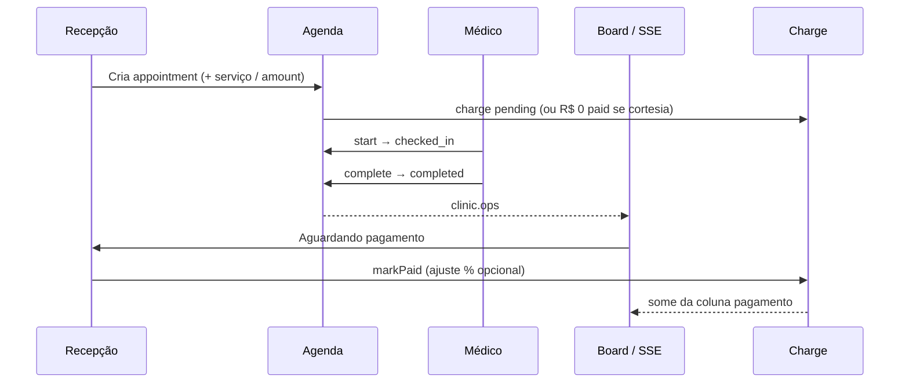
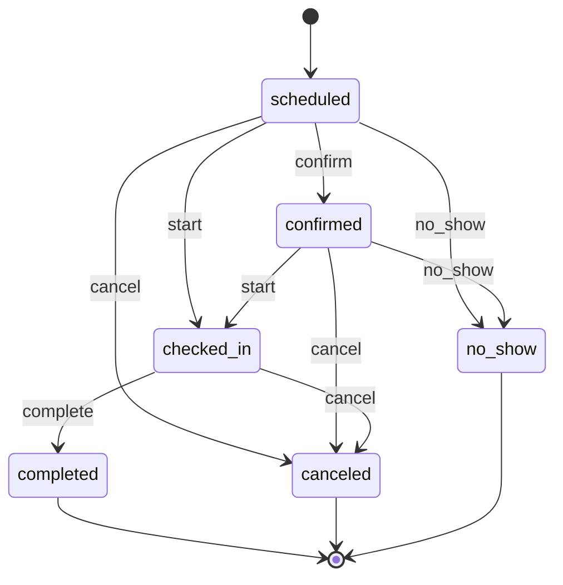
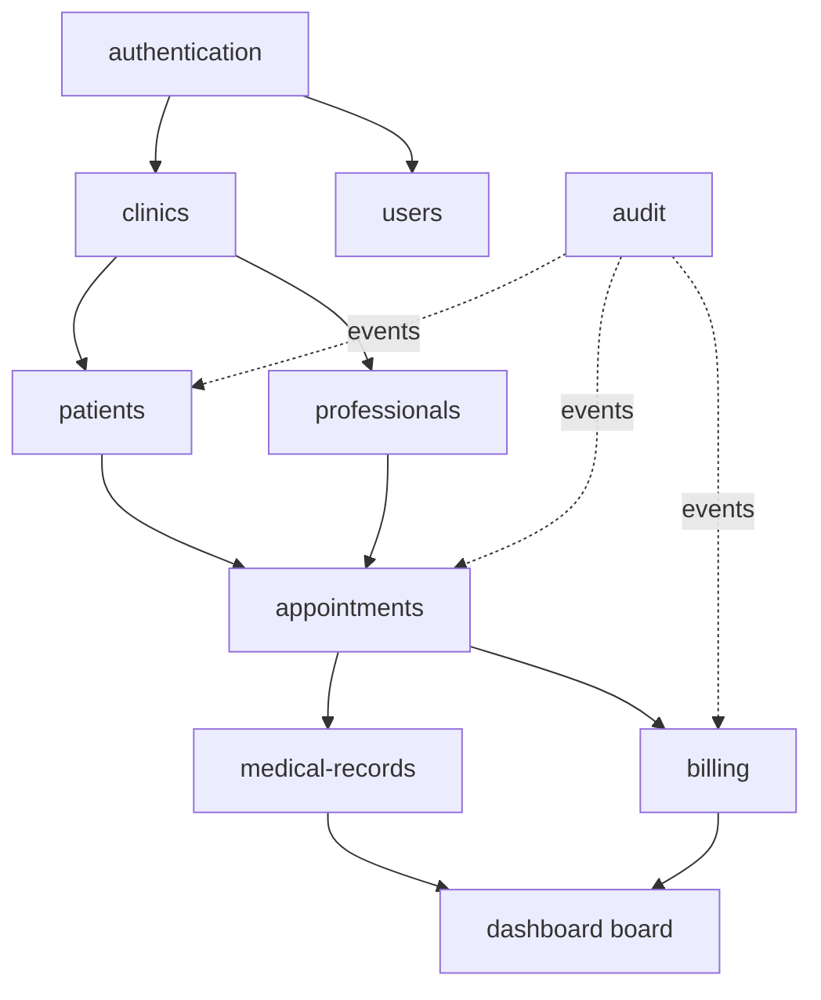

# Diagramas

Diagramas em Mermaid (renderizam na GitHub Wiki e em vários viewers Markdown).

## 1. Camadas da aplicação



## 2. Onboarding e auth (pós-login)

```mermaid
flowchart TD
  A[Login / Session] --> B{mustChangePassword?}
  B -->|sim| C[/change-password]
  B -->|não| D{invite next?}
  D -->|sim| E[Aceitar invite]
  D -->|não| F{emailVerified?}
  F -->|não| G[/verify-email]
  F -->|sim| H{membership?}
  H -->|só suspended| I[/membership-inactive]
  H -->|blocked / seleção| J[/select-clinic]
  H -->|nenhuma| K[/onboarding/plan]
  H -->|ativa + entitled| L[/home]
  K --> M[/onboarding/clinic]
  M --> M2{alsoPractices?}
  M2 -->|sim| M3[Perfil clínico do owner]
  M2 -->|não| N[/onboarding/hours]
  M3 --> N
  N --> L
```

## 3. Fluxo operacional do dia (ADR-006)



> ADR-009 (Planned): serviço do catálogo substitui valor digitado; cortesia/retorno não passa pela coluna de pagamento.


## 4. Máquina de status do appointment



## 5. Domínio financeiro (dois mundos)

```mermaid
flowchart TB
  subgraph SaaS
    U[User owner] --> Sub[subscriptions]
    Sub --> Stripe[Stripe Checkout/Portal]
    Sub --> CS[clinics.subscriptionStatus]
    CS -->|não entitled| Select[/select-clinic]
    Select -->|owner| Account[/account/subscription]
    Select -->|owner delete| Cancel[cancel Stripe + soft-delete]
  end
  subgraph Clinico
    Ap[appointment] --> Ch[charges]
    Ch --> Pay[payments]
  end
  SaaS -.->|não misturar| Clinico
```

## 6. Mapa de módulos (lógico)



Mais detalhes nas páginas de domínio e ADRs.
